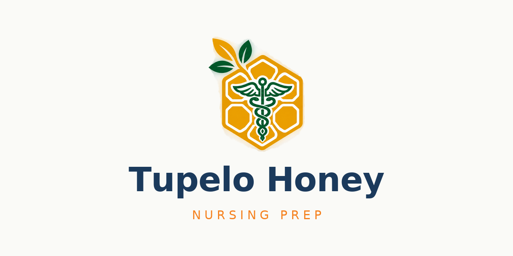

<p align="center">
  
</p>

# Tupelo Honey — Free Nursing Exam Prep

**Pass the TEAS and the HESI A2. Free, forever.**

Tupelo Honey is a complete, self-paced study app for the two exams that gate
nursing school admission — the **ATI TEAS** and the **HESI A2**. It covers all
four tested areas (Reading, Math, Science, English & Language Usage) with
**2,500+ practice questions**, and it does what free flashcards and YouTube
videos can't: it explains **why the right answer is right** and **why each
tempting wrong answer is wrong**.

It is **100% free and open**. No credit card, no trial, no "premium" tier, no
upsell. A student signs up with just an email and gets a personal dashboard
link — that's the whole gate.

---

## Why this exists

I built Tupelo with AI — on purpose.

Nursing is one of the few remaining routes into a stable, family-supporting
career that doesn't require a four-year degree to start — and the TEAS and HESI
are exactly where that route narrows. A readiness exam score quietly decides who
gets into the program, and the students most affected are the ones who can least
afford a $200 test-prep course on top of tuition.

Tupelo is AI used to **open a gate, not close one**. Same tools, aimed at a
concrete problem instead of doom.

This is one of several open educational resources from
[Mu2 Solutions](https://mu2.solutions). The plan is simple: use AI to build 100%
free educational resources for the exams and subjects that big companies gate
behind a paywall — and give them away. I'm not here to sell a subscription. I'm
here to make the paid option unnecessary.

— Muata Kamdibe, Sr. · founder, Mu2 Solutions

---

## What's inside

- **Full coverage** — 2,500+ questions across the four tested areas: Reading,
  Math, Science, and English & Language Usage, written to the TEAS and HESI A2
  content outlines.
- **Explanations, not just answers** — every wrong answer carries its own "why
  this felt right but isn't" rationale, because both exams are engineered around
  plausible-sounding distractors.
- **Study Coach** — a deterministic, no-model coach that reads your results,
  tells you what to work on next, paces you against your exam date, and points
  you at the exact reading for anything you miss.
- **Diagnostic + readiness** — a timed diagnostic baseline, per-domain and
  per-topic readiness, a trend line, and weak-area drill-downs.
- **Works on a phone** — no download, no password; sign up with an email and
  open your link.

### The Study Coach is not an LLM

The core coach is plain, deterministic code — it retrieves and ranks, it doesn't
hallucinate. That's deliberate: the free product's accuracy never depends on a
model that might drift or invent an answer.

### Bring your own AI tutor

There is also an optional AI tutor in the code — a Socratic tutor grounded in the
app's own knowledge base. It is **not** a paid feature and **not** gated. It is
plumbing: point it at any OpenAI-compatible endpoint (a local
[llama-server](https://github.com/ggml-org/llama.cpp) or a cloud model) via the
`TUPELO_TUTOR_ROUTER_URL` / `TUPELO_TUTOR_TEACHER_URL` environment variables,
and it works. Leave them unset and the tutor simply reports its models offline.

---

## Content integrity

Both banks went through a full remediation pass in September 2026, because a
question bank is only as good as its answer key:

- **1,507 explanations** rewritten to remove letter references ("Option B is
  wrong") that break the moment answers are shuffled — explanations now argue
  from content, not from position.
- **78 answer keys** corrected, every one re-derived by hand rather than
  trusted. A root cause: the source bank stored the key as a bare letter while
  the options were scrambled, so the stored key could point at the wrong option.
- **243 explanations** rewritten or repaired after a factual audit (arithmetic
  slips, rules overstated as absolutes, rationales describing options that were
  no longer in the item).
- **2 duplicate questions** removed.

Every change was applied to a backed-up database and verified afterwards:
zero letter references, LaTeX intact, zero malformed records.

---

## License

Split on purpose:

| What | License |
|---|---|
| Source code (the Flask app, templates, scripts, tooling) | [Apache-2.0](LICENSE) |
| Educational content (questions, explanations, lessons, misconception library, glossary) | [CC BY-NC-SA 4.0](LICENSE-CONTENT) |

The content uses the same license OpenStax now applies across its library.
See [ATTRIBUTION.md](ATTRIBUTION.md) for the full attribution, including the
OpenStax source material this project builds on.

## Run it locally

```bash
python3 -m venv venv && source venv/bin/activate
pip install -r requirements.txt
FLASK_SECRET=$(openssl rand -hex 24) python3 app.py
# open http://127.0.0.1:5000
```

Student progress lives in `data/user_progress.db`; the content lives in
`data/tupelo.db`.

For a production run, gunicorn is configured in `gunicorn.conf.py`:

```bash
gunicorn -c gunicorn.conf.py wsgi:app
```

## Contributing

See [CONTRIBUTING.md](CONTRIBUTING.md). In short: open an issue, or fork and open
a pull request. Questions belong in the issue tracker — there is no Discord to
join and no gatekeeper to impress.
